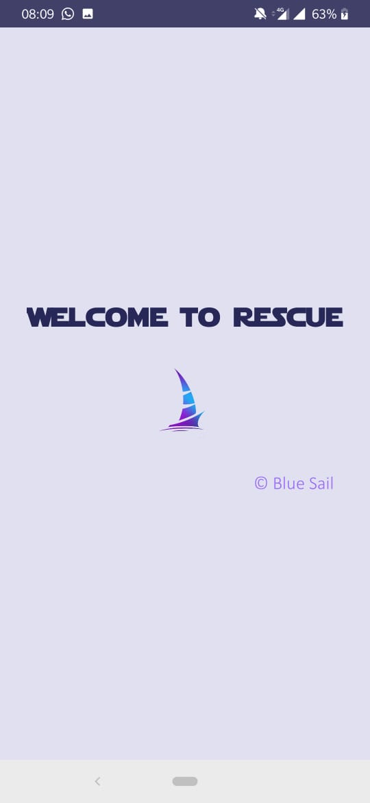
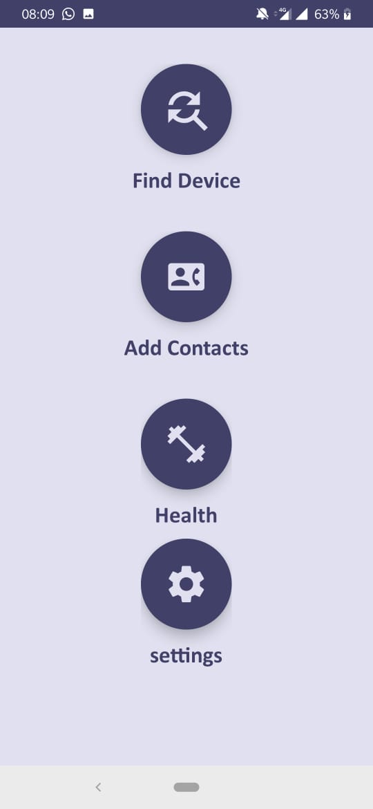
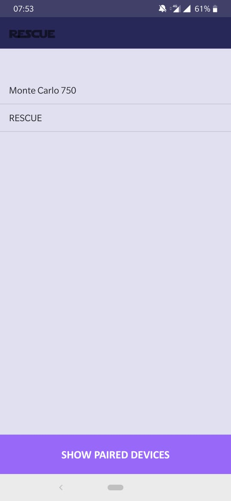
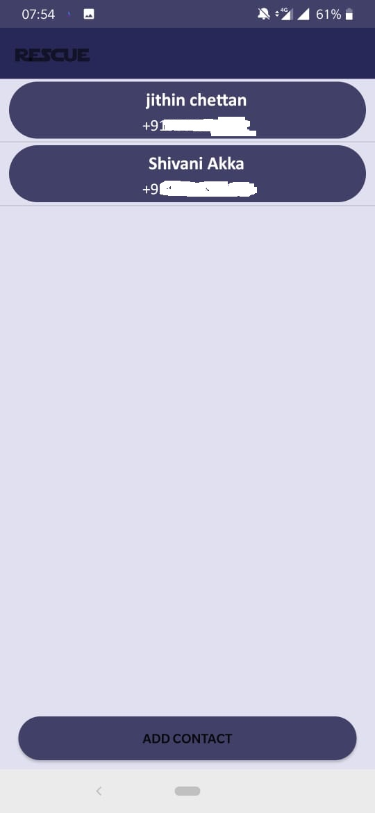
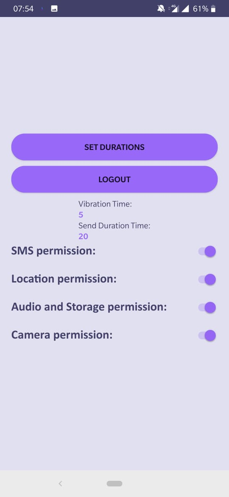
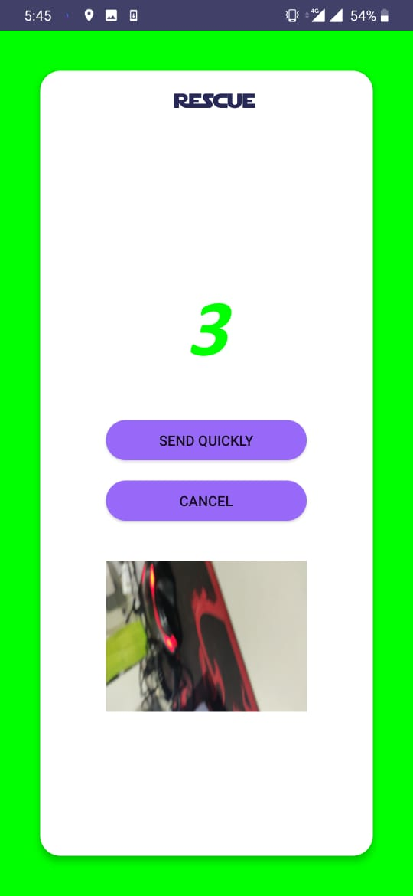
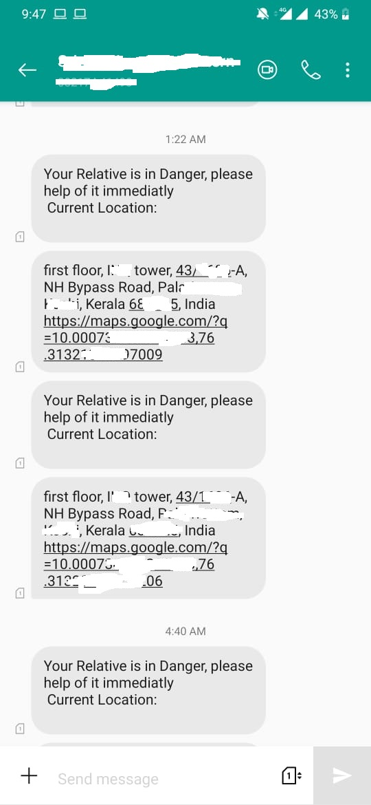
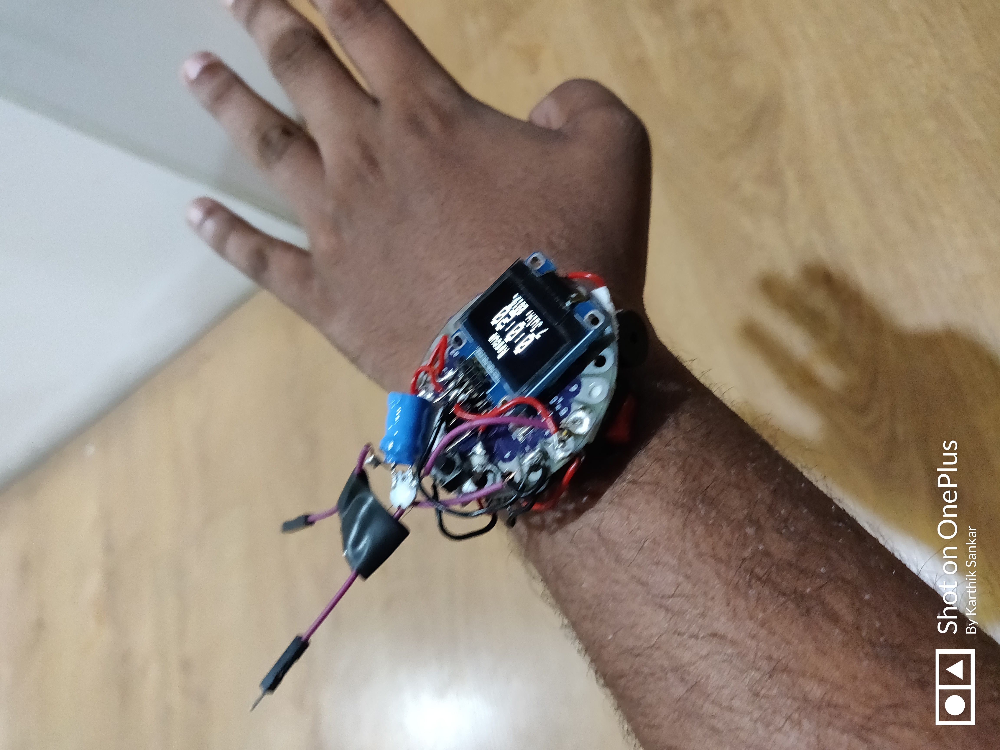
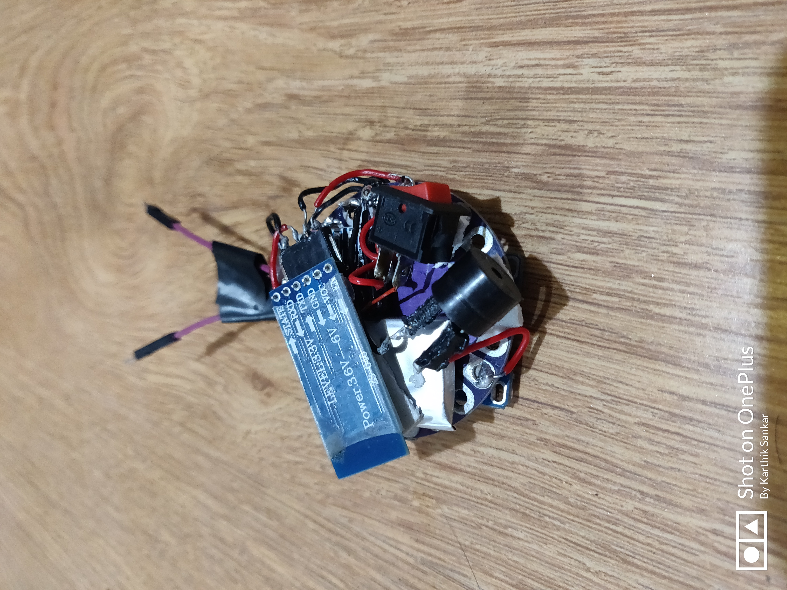

# Rescue App

## Inspiration
There has been a drastic increase in the crime against women over the last few decades. Women once considered as a Goddess is now considered as a mere sexual object. Including the Raichur, Delhi rape cases made us rethink of women's security and it inspired us to solve this issue.

## What it does
This is an app + electronic device. The user in an emergency situation can press the push button on the device, which triggers a signal to the connected phone. The phone receives the signal and vibrates for a given duration as set by the user and waits for a specific time duration before sending an SMS. It sends an SMS with the live GPS location to the contacts listed, requesting help. Simultaneously, the device activates a shock for self-defense, and the video and audio recording begin automatically to store the evidence of the issue. The device also sounds a distress alarm continuously.

## How we built it
We split our work into three domains. Karthik took care of the hardware part, I [Jithin] took care of integrating the hardware with the software [Android App], and Shivani took care of integrating the machine learning part to predict the location with higher risk.

## Challenges we ran into
We faced a lot of issues integrating the device with the app as it was our first time trying something like this. Integrating R with Firebase took longer than expected.

## Accomplishments that we're proud of
We are extremely happy with the product and the progress we made during the 30-hour hack, and it went as we planned. Volunteers appreciated our idea as it was relevant and actually solving a problem.

## What we learned
We learned more about Android Studio, worked with Firebase, R Studio, and Arduino programming.

## What's next for Rescue
We plan to integrate a machine learning-based risk predictor, fall detection for old people, cross-platform application, police and hospital locations on the app, reporting locations with risk using the app, collecting details if traveling for security reasons after 6 PM, and various designs and customizations.

## Built With
- Android Studio
- Buzzer
- Capacitor-based shock circuit
- Embedded C
- Firebase
- Google Maps
- HC-05
- Java
- Li-Po battery
- Lilypad
- Machine Learning
- OLED Display
- R
- Switch
- TP4056

## Project Snapshots

